# Descripción General

CuchaShop es una aplicación móvil multiplataforma compatible con Android e IOS. Desarrollada en React Native como parte del curso de Desarrollo de Aplicaciones de CoderHouse. La aplicación está diseñada para gestionar una tienda en línea de productos para mascotas.


## Características

- **Catálogo de Productos:** Permite visualizar una lista de productos disponibles para la venta, con detalles y precios.
- **Carrito de Compras:** Los usuarios pueden añadir productos al carrito y generar una orden de compra.
- **Autenticación:** Implementa funcionalidades de registro e inicio de sesión para los usuarios.
- **Perfil de Usuario:** Los usuarios pueden añadir una foto de perfil y gestionar su ubicación.


## Tecnologías Utilizadas

- **React Native**
- **Expo Go**
- **JavaScript**
- **Redux Toolkit**
- **Firebase**
- **Expo sqlite**


## Screenshot.
A continuación se muestran imágenes de las distintas pantallas de la aplicación.

### Screen Auth Stack

<div style="display: flex; justify-content: space-around;">
    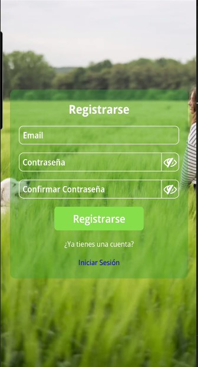
    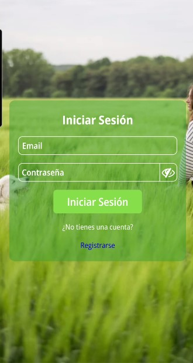
</div>

### Screen Home Stack.

<div style="display: flex; justify-content: space-around;">
    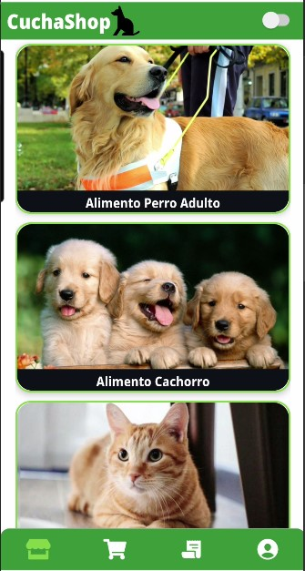
    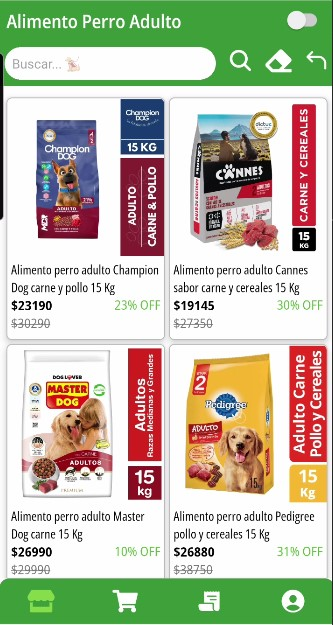
    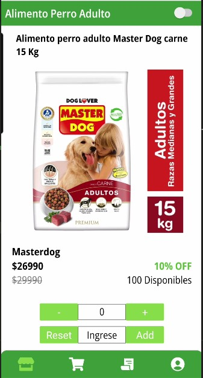
</div>

### Screen Cart Stack

<div style="display: flex; justify-content: space-around;">
    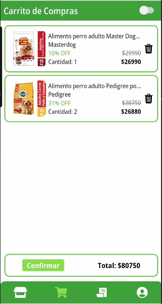
    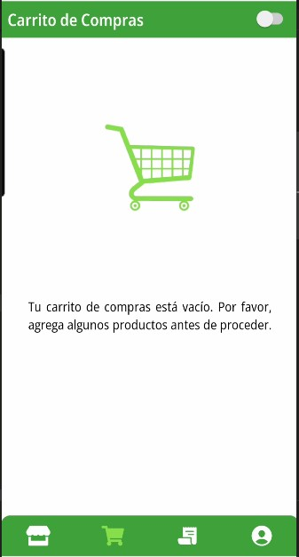
</div>

### Screen Oder Stack

<div style="display: flex; justify-content: space-around;">
    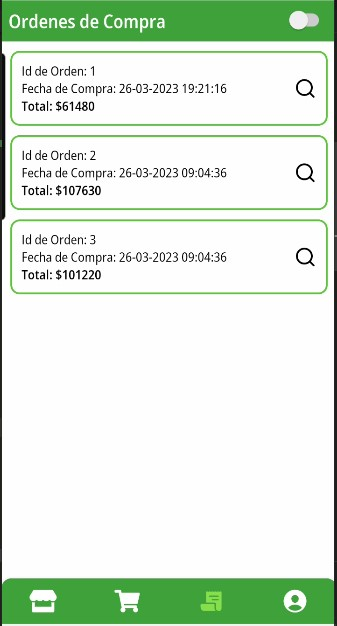
</div>

### Screen My Profile Stack

<div style="display: flex; justify-content: space-around;">
    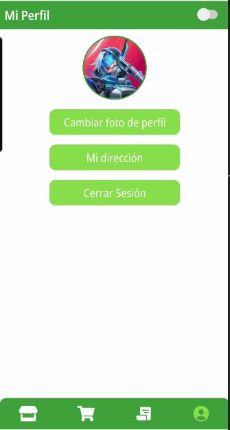
    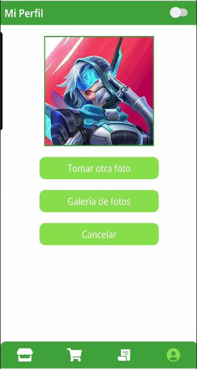
</div>


## Instalación

1. Clonar el repositorio:
    ```sh
    git clone https://github.com/YoniiDev/App-CuchaShop-React-Native.git
    ```
2. Instalar dependencias:
    ```sh
    npm install
    ```
3. Ejecutar la aplicación:
    ```sh
    npm expo start
    ```


## Ejecución Con la App Expo Go

1. Instala la aplicación Expo Go desde la PlayStore o AppStore.

2. Abre la app Expo Go y selecciona "Scan QR code".
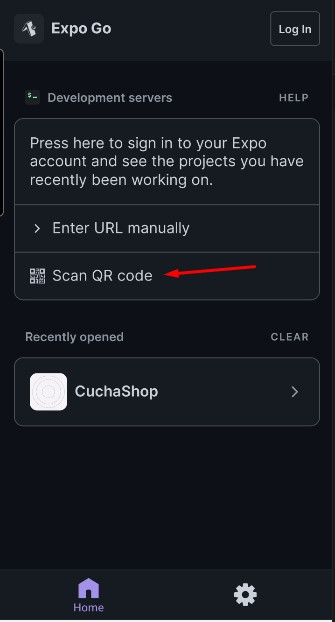

3. Escanea el código QR que aparecerá en la consola después de haber ejecutado el comando npx expo start.


## Ejecución Con Android Studio

Debes tener configurado previamente un dispositivo en el emulador de Android Studio para seguir estos pasos:

1. Abre Android Studio y luego inicia cualquier emulación de un dispositivo Android.

2. Una vez iniciada la emulación de un dispositivo Android, ejecuta en la consola el siguiente comando:

    ```sh
    expo start --android
    ```

3. Este comando instalará la app de Expo Go en el emulador y abrirá el proyecto.


